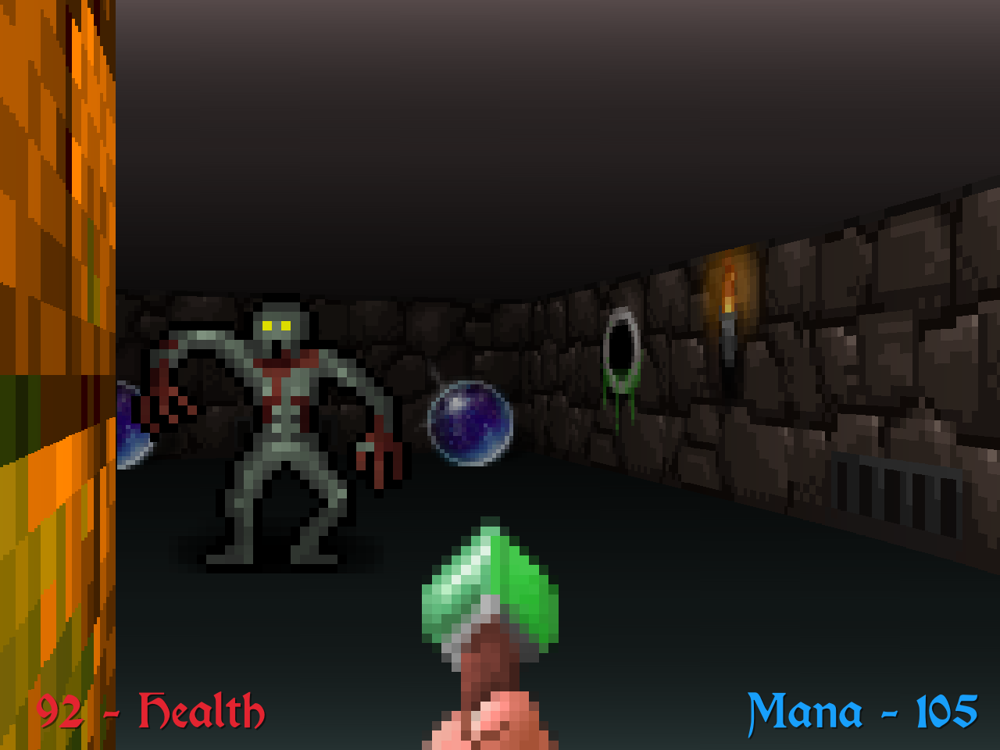
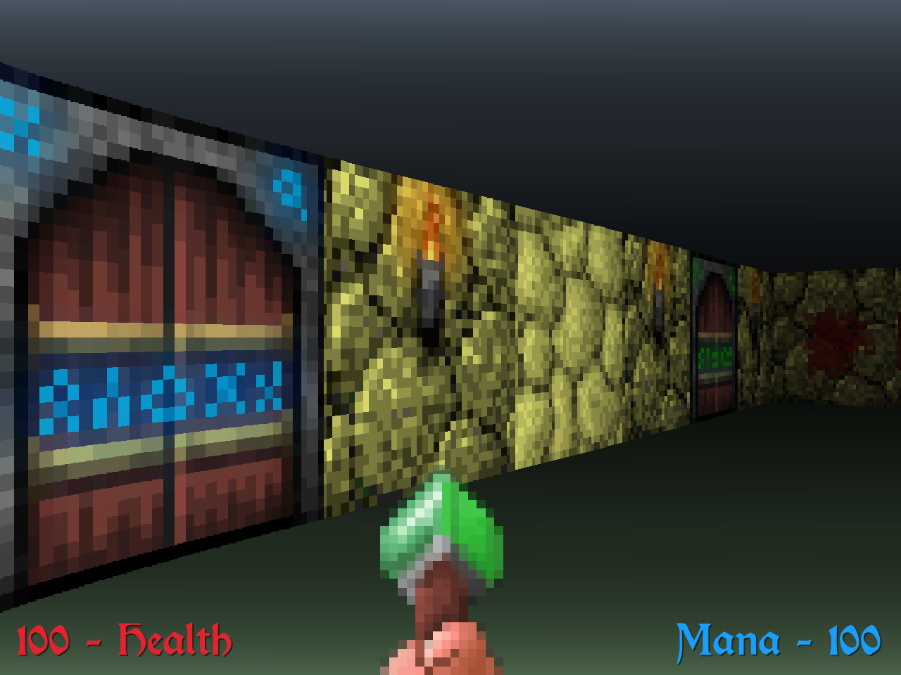
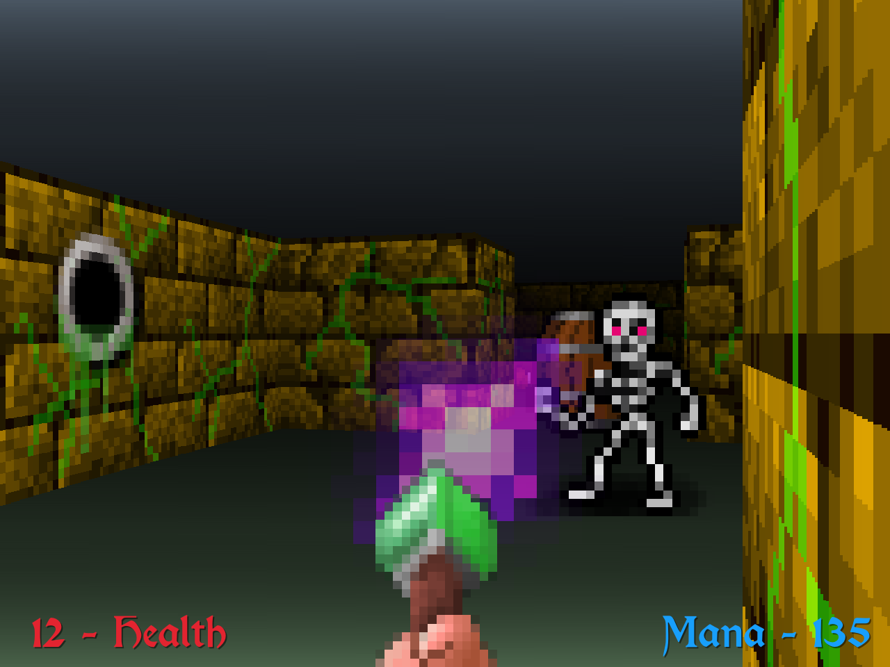
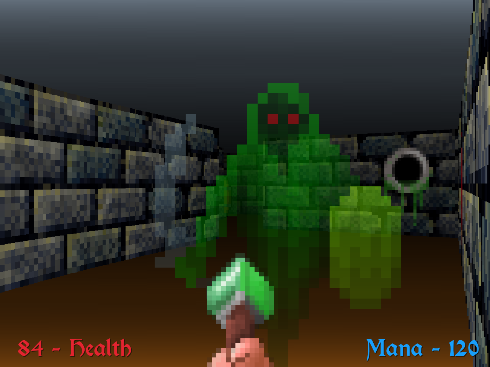
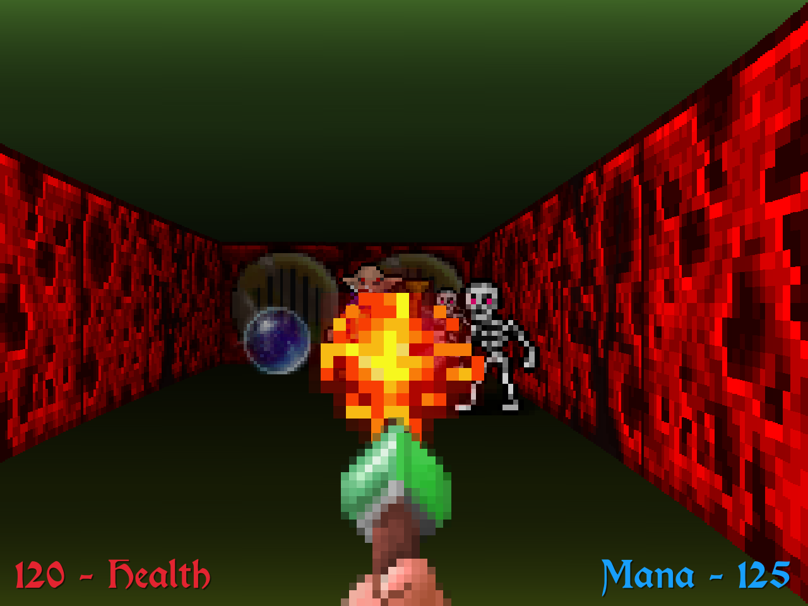
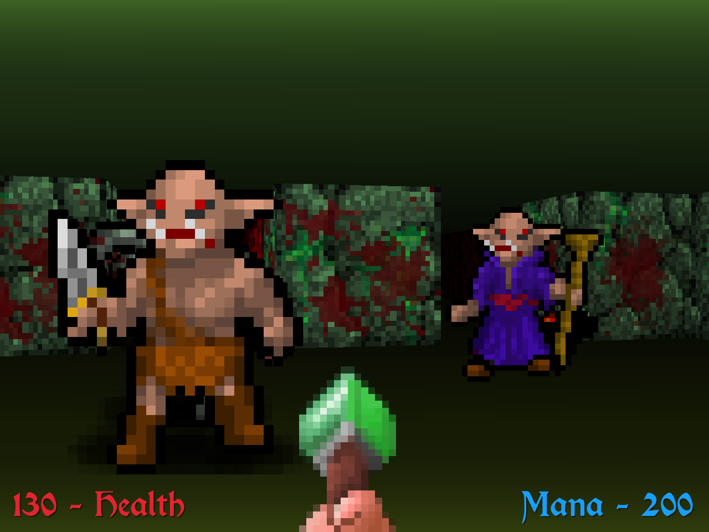

# Crypt Caster 🧙🪄🏰💀🔮

A experiment in creating a raycasting based FPS/adventure game.
Based heavily on this guide and tutorial - https://github.com/ssloy/tinyraycaster/wiki

Raycasters are essentially a fake 3D view, generated in a 2D plane, a system used by early FPS games like Wolfenstein  3D, Doom, Duke Nukem, Ultima Underworld, Legends of Valour and many many more

This developed from a proof of concept of the game engine, into somewhat of a fully playable game. There are still several bugs, especially with the monster movement and AI but it doesn't spoil the fun too much.

The game is written in Go, and uses the Ebiten open source game library https://ebiten.org/. However everything is developed from first principals, Ebiten providing little more than a means to read image files, and a way to render pixels to the screen (plus reading input & audio). The code structure is deliberately simple (just a single main package) in order to focus on the goal of getting somethign playable.

Game Features:

- Multiple crypts to explore, can you find the exit?
- Six terrifying monsters & creatures to battle
- Secret walls and switches, where do they lead?
- Locked doors and keys
- Health potions, mana spheres and food to eat, yum!

## Screens Shots








---

[](https://youtu.be/qcmcv_ifNxM)

Video playthrough

## Installing & Running

- Download the [release zip from the releases page](https://github.com/benc-uk/caster/releases)
- Unzip the zip file anywhere
- CD into unzipped directory
- Run `caster` or `caster.exe`

Optional arguments:

```txt
  -debug
        Enable debug mode (default false)
  -fullscreen
        Fullscreen mode (default false)
  -level <map name>
        Auto start in this level/map
  -ratio int
        Ray rendering ratio as a percentage of screen width (default 4)
  -res string
        Screen resolution: tiny, small, medium, large, larger or super (default "medium")
  -vsync
        Enable vsync (default false)
```

## Controls

| Control     | Key(s)                     |
| ----------- | -------------------------- |
| Move player | Cursor keys and WASD       |
| Fire magic  | Shift keys (left or right) |
| Use/open    | Spacebar                   |
| Strafe      | Hold Alt                   |
| Open Map    | Tab                        |
| Zoom Map    | Plus / minus keys          |
| Pause/menu  | Escape                     |

## Level Editor

There is a web based level editor included


To run the level editor you will need Node.js installed and can run:

```bash
make run-editor
```

Then open http://localhost:8080/editor

If you don't have Node.js but have a means to start a HTTP server locally, then that can be used instead, run it in the root of this repo but go to /editor in the browser.

## Level Editor Usage

- Add walls by left clicking, click and drag with the left button to draw walls
- Clear a cell by right clicking
- Monsters, doors and items can only go into empty cells, decorations and extras can only go on top of walls.
- There's three additional modes, which can be accessed by holding a key:
  - Hold 'i' to add items. Note the last two items "barrel" and "column" are cosmetic and act like walls
  - Hold 'm' to add monsters
  - Hold 'd' to add doors, the basic door requires no key, the three colored doors have corresponding key items, the last door is designed to be opened with a switch.
  - Hold 'x' to add extras to a wall. These are mostly decorations such as torches and splats of blood. There are three special types:
    - Switch (brown rectangle) is a button which when pressed, can be used to remove a wall or door. You will be prompted for the X,Y cell that the switch affects.
    - Secret wall (question mark) this will mark a wall as secret, when pressed/used it will disappear and open
    - Exit (dark entryway) this is the exit and way to complete the level
  - Hold 'w' to switch to wall mode, which is the default
  - Hold 'p' to move the player start location, holding 'p' and clicking to the current position will rotate their starting facing.

There is a bug after adding switch, you will have to press 'w' to return to wall mode.

## Credits & Attributions

Graphics taken from Dungeon Crawl Stone Soup tile pack - https://opengameart.org/content/dungeon-crawl-32x32-tiles-supplemental used under the CC0 license.

Music taken from https://soundimage.org/fantasywonder/ and distributed under the license terms there

Many sound effects from https://freesound.org/

